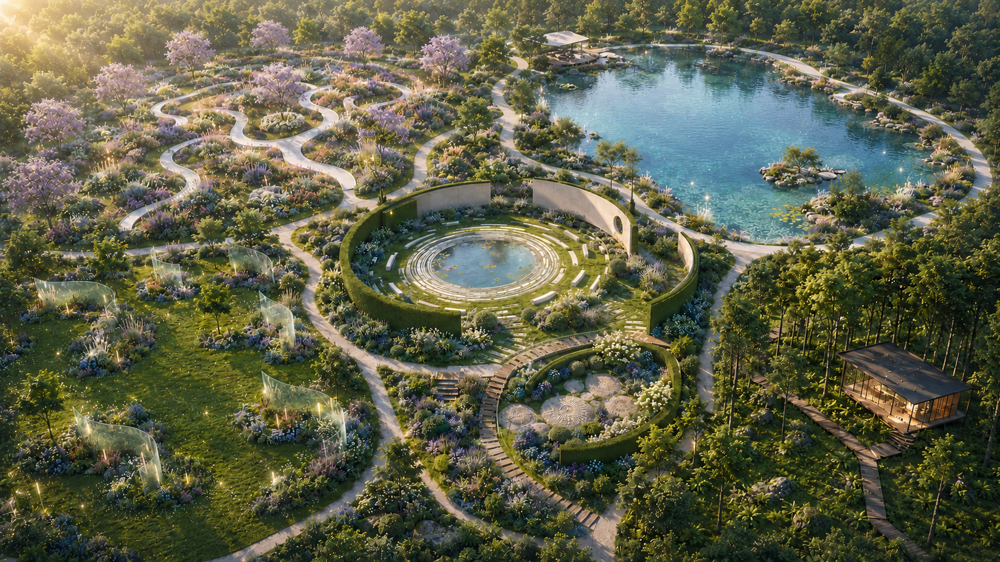

# Project Seed Bank

Project Seed Bank is a personal project garden where ideas, side projects, learning plans, and creative prototypes are planted as digital plants and cultivated over time.

Live demo: [https://yangzi831.github.io/project-seed-bank/](https://yangzi831.github.io/project-seed-bank/)

## AI 协作（黑客松窗口）

本项目使用独立的 A2A 轻量协议协调 Pilot 窗口与 Codex 窗口（与乐理小达人仓库的 A2A 互相独立）：

- [A2A-ROUTING.md](docs/A2A-ROUTING.md) — 角色分工、触发词、当前切片
- [A2A-PROTOCOL.md](docs/A2A-PROTOCOL.md) — 消息信封、回合礼仪、授权粒度
- [A2A-DECISION-LOG.md](docs/A2A-DECISION-LOG.md) — 决策流水与当前断点

新窗口接入前请先读这三个文件。

## Project Idea

Most project tools treat ideas as tasks, tickets, or database rows. Project Seed Bank explores a softer model: personal projects as living seeds.

Instead of asking whether an idea is finished or unfinished, the app lets a project move through a more natural rhythm:

- growing
- mature
- dormant
- harvested

The interface is built around a five-zone creative garden. Each zone carries a different kind of project energy: visual expression, reflection, exhibition, system-building, and experimentation. The goal is to make personal work feel observable, revisitable, and alive.

## Core Features

- **Garden Overview**  
  A full estate map with five clickable garden zones and visible project plants.

- **Five Garden Zones**  
  Each zone has its own large map, project plants, and quick navigation to other gardens.

- **Project Planting**  
  Add a project with a short description, garden zone, plant category, and selected plant variant.

- **Plant Library**  
  A fixed 24-plant visual atlas with growing and mature states.

- **Growth Dossier**  
  Each project has a detail modal for status, plant preview, logs, outcomes, and plant replacement.

- **Growth Logs**  
  Record progress notes over time.

- **Outcomes**  
  Save text, links, image links, or file path placeholders as project results.

- **Growth Board**  
  View projects by status: growing, mature, dormant, and harvested.

- **Local-first Demo Data**  
  Current data is stored in browser `localStorage`; no backend or account system is required.

## Screenshots

> Screenshots will be added as the visual layout stabilizes.

### Garden Overview

### Garden Zone

_Screenshot placeholder: single Garden page with plants on the zone canvas._

### Plant Library

_Screenshot placeholder: 24-plant atlas showing mature and growing states._

### Project Growth Dossier

_Screenshot placeholder: project detail modal with plant preview, logs, and outcomes._

## Technology Stack

- Vite
- React
- TypeScript
- Plain CSS
- Browser `localStorage`
- GitHub Pages
- GitHub Actions

The project intentionally avoids a backend, login, AI API, UI component library, WebGL, and file upload in the current demo stage.

## Current Status

Project Seed Bank is currently a working frontend demo.

Completed:

- Garden overview and five garden zones
- Real plant PNG asset library
- Project creation, editing, deletion, and status updates
- Plant selection and replacement
- Project logs and outcome records
- Drag positioning for plants on maps
- Plants atlas page
- Growth board
- GitHub Pages deployment

Still evolving:

- Tablet and mobile layout polish
- Screenshot documentation
- More refined plant placement behavior
- Better long-term persistence model beyond localStorage
- AI and Agent features

## Future Plan: AI Garden Keeper Agent

The next phase imagines AI not as a chatbot, but as an Agent that quietly accompanies the lifecycle of creative projects.

### 🌱 Seed Discovery

AI helps users turn vague ideas into concrete project seeds:

- Distill the project direction
- Generate an initial project structure
- Suggest early exploration paths

### 🌿 Growth Companion

AI understands the materials that appear during a project's growth:

- Creative logs
- Inspiration fragments
- Images and multimodal records

It helps users:

- Summarize stage outcomes
- Notice how a project is changing
- Suggest the next direction to explore

### 🌳 Garden Keeper

AI observes the user's project garden over time:

- Which projects are actively growing
- Which projects are temporarily dormant
- Which ideas may be connected to each other

AI does not create in place of the user. It helps users rediscover their own creative signals.

### 🌸 Harvest Assistant

When a project reaches a harvested state, AI helps turn the work into shareable material:

- Project Story
- Portfolio Description
- Exhibition Introduction
- Release Notes

Seed Bank imagines AI as a creative companion rather than a replacement for creators.

The AI Garden Keeper grows together with users, helping ideas evolve from seeds into mature creative projects.
