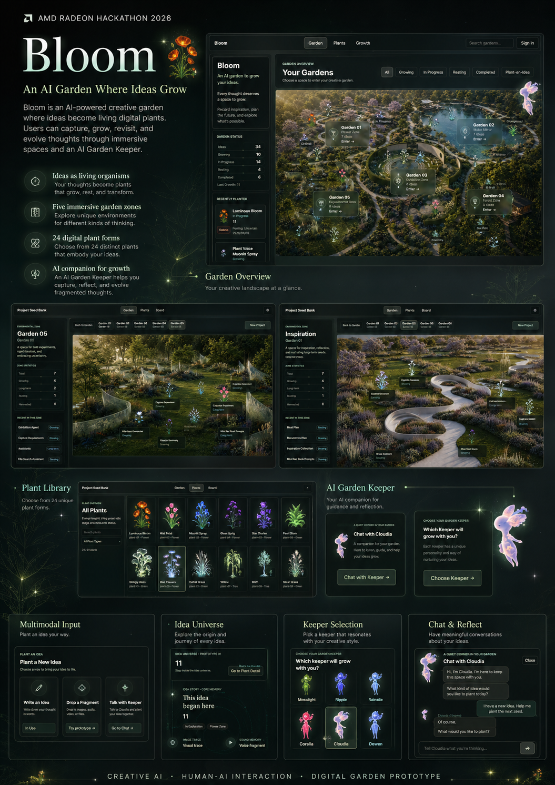
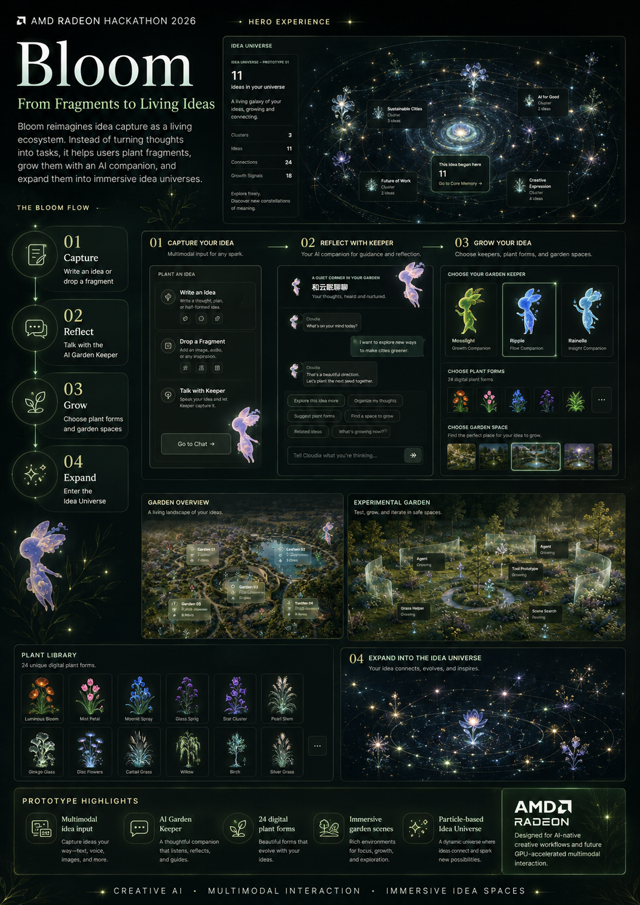

# Bloom

### An AI garden where your ideas grow. / 一座让想法自然生长的 AI 花园。

<p align="center">
  
  
</p>

**Bloom** is an AI-powered creative garden where ideas become living digital plants. Capture a fragment, grow it with an AI Garden Keeper, and revisit it through immersive garden spaces and connected idea universes.

**Bloom** 是一座由 AI 驱动的创意花园。在这里，想法不再只是待办事项，而会成为有生命的数字植物：你可以捕捉灵感碎片，与 AI 花园守护者一起培育它，并在沉浸式花园与想法宇宙中重新发现它。

> **Live preview / 在线体验:** [yangzi831.github.io/Bloom](https://yangzi831.github.io/Bloom/)  
> The public build may temporarily lag behind the latest repository demo. / 线上版本可能暂时落后于仓库中的最新演示。

## Why Bloom / 为什么是 Bloom

Most productivity tools turn an idea into a task, ticket, or deadline. That helps execution, but often loses the emotional, uncertain, and exploratory parts of creativity. Bloom asks a different question: **what if an idea were something alive?**

大多数效率工具会把想法变成任务、工单或截止日期。它们擅长推动执行，却容易忽略创作中感性、模糊和探索性的部分。Bloom 想问的是：**如果一个想法本身就是生命，会怎样？**

In Bloom, an idea can grow quickly, stay unfinished, enter dormancy, form new connections, or return after being forgotten. AI is not a replacement for the creator; it is a quiet companion that helps the user notice what is already emerging.

在 Bloom 中，一个想法可以快速生长，也可以保持未完成、进入休眠、产生新的连接，或在被遗忘后再次苏醒。AI 不取代创作者，而是安静地陪伴，让那些正在萌芽的东西更容易被看见。

## Core Experience / 核心体验

### 1. Digital Idea Garden / 数字想法花园

Every idea receives a living digital form instead of becoming another task card. Its creative rhythm is expressed through four stages: **Growing**, **Forming**, **Dormant**, and **Harvested**.

每个想法都会获得一种数字生命形态，而不是变成另一张任务卡。它会经历四种创作状态：**生长中**、**成形中**、**休眠中**和**已收获**。这些阶段描述的是创作节奏，而不是效率评分。

### 2. Garden Ecosystem / 花园生态

Ideas live across five spaces: the **Inspiration Garden**, **Water Mirror Garden**, **Exhibition Garden**, **Forest Garden**, and **Experimental Garden**. Each zone represents a different creative condition, from reflection and memory to prototyping and playful mutation.

想法可以生活在五种空间里：**灵感花园**、**水镜花园**、**展览花园**、**森林花园**与**实验花园**。每个区域对应一种不同的思考状态，从回忆与反思，到原型探索与自由试验。

### 3. Plant Library / 植物图鉴

Bloom includes **24 original digital plant forms**. Each plant has its own silhouette, atmosphere, and growth expression, turning the plant into the idea's body rather than a decorative category label.

Bloom 提供 **24 种原创数字植物形态**。每株植物都有独特的轮廓、氛围与生长表现；它不是装饰性的分类标签，而是想法在花园中的身体。

### 4. AI Garden Keeper / AI 花园守护者

The Garden Keeper is a companion agent that lives inside the garden. It can organize fragments, reveal possible connections, reflect on long-term growth, revisit dormant ideas, and turn vague intentions into clearer creative starting points.

花园守护者是生活在花园里的陪伴型 Agent。它能整理零散念头、发现潜在联系、回顾长期成长轨迹、唤醒休眠想法，并把模糊意图转化为更清晰的创作起点。

Six Keeper personalities provide different styles of companionship, from gentle preservation and reflection to experimentation and forward movement. The demo combines structured agent flows, contextual garden data, provider-compatible AI integration, and stable fallback conversations.

六位守护者拥有不同的陪伴方式：有的擅长温柔保存与反思，有的更偏向实验和推动。当前演示结合了结构化 Agent 流程、花园上下文、兼容多种服务商的 AI 接入，以及稳定的后备对话体验。

### 5. Multimodal Idea Input / 多模态灵感输入

Ideas can begin as fragments rather than polished descriptions. The **Drop a Fragment** prototype explores text, image, audio, video, and file input. A Keeper can observe the fragment and suggest a name, description, Garden Zone, and plant form before the user plants it.

想法不必从完整描述开始。**投下一枚碎片**原型探索了文本、图片、音频、视频和文件输入；守护者会先观察碎片，再推荐名称、描述、花园区域与植物形态，最后由用户决定是否种下。

The current release implements the interaction and presentation prototype. Full multimodal inference and production file processing remain future extensions.

当前版本已经实现交互与展示原型；完整的多模态推理和生产级文件处理仍属于后续方向。

### 6. Idea Universe / 想法宇宙

An individual plant can expand into an inhabitable creative world containing its story, growth traces, visual fragments, process records, Keeper reflections, and future works. The current **Luminous Bloom** prototype is a structured 3D particle organism with a complete spatial view.

一株植物可以继续展开为可进入的创意世界，容纳它的故事、生长轨迹、视觉碎片、过程记录、守护者反思与未来作品。当前的 **Luminous Bloom** 原型是一株结构化的 3D 粒子植物，可以从完整空间视角观察。

## Architecture / 技术架构

### Frontend / 前端

- React + TypeScript + Vite
- Responsive spatial garden interfaces / 响应式空间化花园界面
- Local-first demo state with cloud-integration compatibility / 本地优先的演示状态，并兼容现有云端集成
- Three.js particle-based plant experiments / 基于 Three.js 的粒子植物实验

### AI Layer / AI 层

- Garden-aware Agent request, context, response, and suggestion structures
- Context assembled from ideas, journals, outputs, garden state, and Keeper personality
- Provider-compatible AI service layer with designed demo fallbacks
- 面向花园场景的 Agent 请求、上下文、回复与建议结构
- 从想法、日志、产出、花园状态和守护者人格中组装上下文
- 兼容多种服务商，并为稳定演示提供设计好的后备流程

### Visual System / 视觉系统

- 24 original digital plant assets / 24 种原创数字植物资产
- Five immersive garden scenes / 五个沉浸式花园场景
- Layered stars, light traces, orbital motion, and spatial fragments / 分层星光、光迹、轨道运动与空间碎片
- A foundation for future interactive 3D creative environments / 面向未来交互式 3D 创作环境的基础

## AMD / GPU Adaptation / AMD 与 GPU 适配

Bloom is designed for AI-native creative workflows where local intelligence and visual computing become part of everyday ideation. Radeon GPU acceleration can support private local multimodal inference, faster creative generation, denser real-time particles, and future navigable 3D idea worlds.

Bloom 面向 AI 原生的创作流程，让本地智能与视觉计算进入日常灵感活动。Radeon GPU 加速可用于隐私友好的本地多模态推理、更快的创意生成、更高密度的实时粒子效果，以及未来可自由探索的 3D 想法世界。

This creates a continuous experience connecting local AI inference, real-time graphics, and long-term personal creative memory.

这让本地 AI 推理、实时图形与个人长期创作记忆能够汇聚在同一段连续体验中。

## Demo Flow / 演示流程

1. **Enter Bloom / 进入 Bloom** - See a personal landscape where ideas live as plants. / 看见想法以植物形式生活的个人创意景观。
2. **Explore Garden Zones / 探索花园区域** - Move through five different modes of thinking. / 穿行于五种不同的思考状态。
3. **Browse the Plant Library / 浏览植物图鉴** - Discover 24 possible living forms. / 发现 24 种想法生命形态。
4. **Choose a Keeper / 选择守护者** - Find a companion with the right personality. / 找到与你共鸣的陪伴人格。
5. **Plant a Fragment / 种下灵感碎片** - Turn multimodal input into a plantable idea. / 把多模态输入转化为可以种下的想法。
6. **Enter an Idea Universe / 进入想法宇宙** - Explore a plant and its creative traces in 3D space. / 在 3D 空间中探索植物与它的创作轨迹。

## Run Locally / 本地运行

Install dependencies and start the development server. / 安装依赖并启动开发服务器：

```bash
npm install
npm run dev
```

Open / 打开：

```text
http://127.0.0.1:5173/garden
```

Create a production build. / 创建生产构建：

```bash
npm run build
```

## Current Scope / 当前范围

The repository currently includes a complete interactive garden, five spatial zones, idea planting and growth states, journals and outcomes, 24 plant forms, six Keeper identities, garden-aware Agent interactions, a multimodal input prototype, and the Luminous Bloom particle universe.

当前仓库包含完整的交互式花园、五个空间区域、想法种植与成长状态、日志与成果、24 种植物形态、六位守护者、理解花园上下文的 Agent 交互、多模态输入原型，以及 Luminous Bloom 粒子宇宙。

The prototype focuses on experience, interaction language, and visual direction. Production-scale multimodal processing, a generalized universe for every plant, and GPU-optimized rendering remain future work.

当前原型重点验证体验、交互语言与视觉方向。生产级多模态处理、适用于每株植物的通用想法宇宙，以及 GPU 优化渲染仍是未来工作。

## Future Vision / 未来愿景

Bloom aims to connect AI, creativity, and everyday life. It imagines a place where anyone can preserve an unfinished thought, recognize patterns across years of exploration, and experience ideas as interactive digital life.

Bloom 希望连接 AI、创造力与日常生活。任何人都可以在这里保存一个未完成的念头，从多年的探索中看见规律，并把想法体验为可互动的数字生命。

AI becomes a companion that helps people stay in relationship with their own imagination. The garden becomes a living archive not only of what was completed, but of everything that was once worth growing.

AI 将成为帮助人们与自身想象力保持联系的伙伴。花园则成为一座活着的档案馆：它不仅记录已经完成的作品，也珍藏每一个曾经值得生长的念头。
